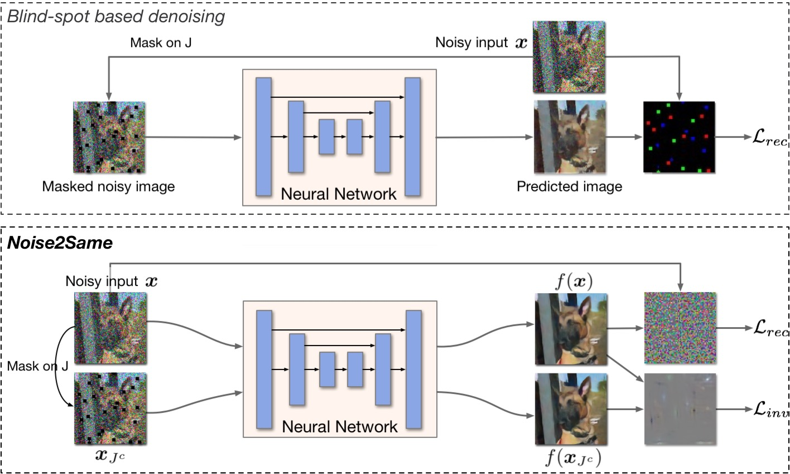
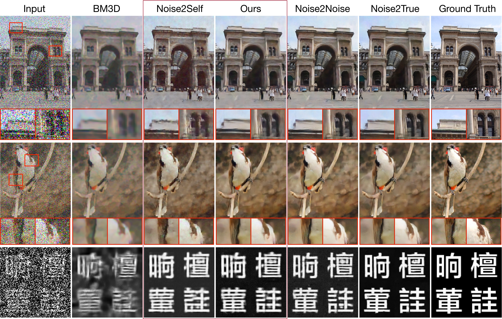

# Noise2Same
TensorFlow implementation for the [paper](https://arxiv.org/abs/2010.11971) "Noise2Same: Optimizing A Self-Supervised Bound for Image Denoising"

 
 

## Environment Requirements
- jupyter
- python == 3.7.2
- tensorflow >=1.10 & <=1.15
- scipy
- skimage
- tifffile

## Usage

### To reproduce our results

#### Dataset and model checkpoint download
We uploaded the datasets used in our experiments and the model checkpoint files to the google drive [here](https://drive.google.com/drive/folders/1VYMo1OoaGxoOLNx6-qIt2Wg03lsZw_kA?usp=sharing). You can download the files and put them in the folders ``Denoising_data`` and ``trained_models``. More details about the dataset construction and the source of data can be found under [Denoising_data](./Denoising_data).

We have provided four examples in Jupyter Notebook that can reproduce our results in the paper. Once you have downloaded the dataset (and the pretrained chechpoints if you want to skip training), you can simply go through the notebooks for reproduction.

### To train, evaluate and predict with your own datasets
You can follow the examples in Jupyter Notebook for denoising with RGB images, grayscale images and 3D images.

#### To be specific, the following code is used to build the model.
```
from models import Noise2Same
model = Noise2Same(model_dir, model_name, dimension, in_channels)
```
where ``model_dir`` and ``model_name`` will specify the path to your checkpoint files, ``dimension`` refers to the dimension of image *(2 or 3)* and ``in_channels`` refers to the number of channels of input images.

#### The following code is used for **training**.
```
model.train(X, patch_size, validation=X_val, batch_size, steps)
```
where ``X`` and ``X_val`` are the noisy images for training/validation of shape ``[n_samples, width, length, n_channels]`` and of type ``float32``, ``patch_size`` specify the size to crop input images to training patches. Note that the input image should be **normalized** before input for training.

#### The following codes are for **prediction**.

- For prediction of single image,
  ```
  model.predict(img[, im_mean, im_std])
  ```
  where ``img`` is the noisy image for prediction, ``im_mean`` and ``im_std`` are the mean and standard deviation. If ``im_mean`` and ``im_std`` are not specified, it will use ``img.mean()`` and ``img.std()`` by default.

- For prediction of batched images (and you have enough GPU memory),
  ```
  model.batch_predict(images.astype('float32'), batch_size[, im_mean, im_std])
  ```

- For extremely large images, e.g. CARE 3D images,
  ```
  model.crop_predict(image, crop_size, overlap[, im_mean, im_std])
  ```

### Use Noise2Same under other frameworks
You can follow the pseudocode below to build the Noise2Same model.

Given the noisy images ``images``, the masked noisy images ``masked_images`` and masking map ``mask`` with masked locations being 1 and other 0,

```
net = YourNetwork()
# The two net() below should share their weights
out_raw = net(images)
out_masked = net(masked_images) 

l_rec = reduce_mean((out_raw - images)^2)
l_inv = reduce_sum((out_raw - out_masked)^2 * mask) / reduce_sum(mask)
loss = l_rec + 2 * sqrt(l_inv)
```

## Web Demo
You can create a web-based demo to run inference by running the `demo.py` file, which uses the `gradio` Python library.

Here is a live demo: https://gradio.app/g/Noise2Same


